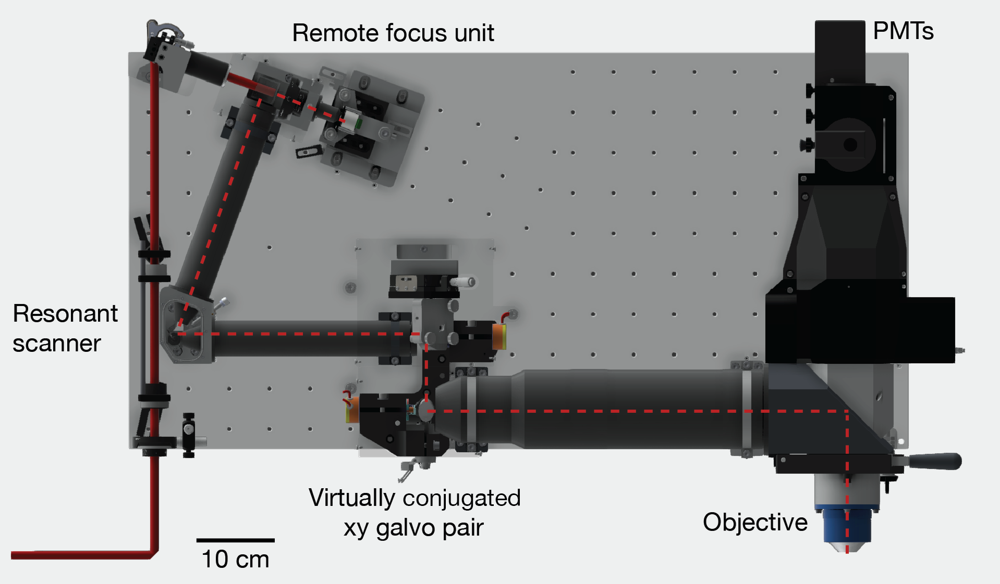

# design-files
`model.dwfx` is a 3D model of the 2p-RAM made by Dan Flickinger. To view the file you can either download the free [Autodesk Design Review](http://www.autodesk.com/products/design-review/overview) software or just upload the file directly to their [online viewer](https://a360.autodesk.com/viewer) and view it in your browser.

